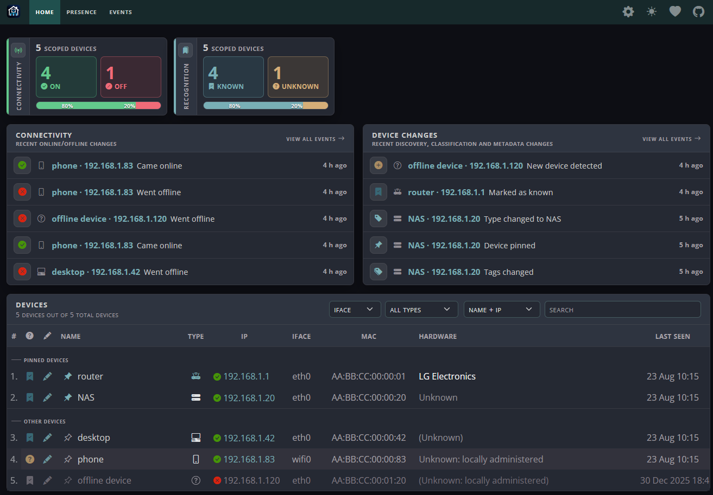

<h1>
  
  LANnventory
</h1>

LANnventory is an actively developed fork of [WatchYourLAN by aceberg](https://github.com/aceberg/WatchYourLAN), focused on modern LAN inventory, device presence history, event tracking, classification and a self-contained web interface.

> [!IMPORTANT]
> LANnventory is still under active development. Features, configuration, packaging and upgrade instructions may continue to change until the first beta release is prepared.

Current repository: [godlev/WatchYourLAN2](https://github.com/godlev/WatchYourLAN2)

The original WatchYourLAN scanning/backend foundation is preserved and credited. LANnventory adds a substantially expanded interface, persistent event model, device classification, configurable retention, migration hardening, safer configuration handling and other reliability improvements.

## LANnventory dashboard



## Highlights

### Modern local-first interface

- Compact responsive dashboard.
- Dark and light color modes.
- Local Open Sans fonts.
- Local Bootstrap Icons.
- Local Bootswatch themes.
- LANnventory favicon and navbar icon assets bundled locally.
- No automatic external UI asset requests after build.

### Home dashboard

- Summary cards for Total, Online, Offline, Known and Unknown devices.
- Shared filtering by interface, device type, recognition state, online state and search.
- Search across device information such as name and IP.
- Device Type filtering integrated with dashboard counts and recent event panels.
- Compact device table with sticky column headings.
- Device names link to read-only Host details.
- Direct edit shortcut from the device table.
- Recent Connectivity and Device Changes panels.
- Recent event panels automatically follow the currently filtered device set.

### Device management

- Persistent Known / Unknown classification.
- Persistent manual Device Type classification.
- Device Type icon picker.
- Supported device types include:
  - Router
  - Switch
  - Access Point
  - Firewall
  - Server
  - NAS
  - Desktop
  - Laptop
  - Phone
  - Tablet
  - TV
  - Printer
  - Camera
  - IoT
  - Virtual Machine
  - Container
  - Game Console
  - Other
- Host page defaults to read mode.
- Explicit Host edit mode for editable properties.
- Wake-on-LAN and port-scan actions remain available where supported.

### Presence

Presence represents sampled online/offline visibility over time.

Features include:

- Search by device name, IP and other shared device fields.
- Filter by interface.
- Filter by Device Type.
- Filter by Known / Unknown state.
- Filter by current Online / Offline state.
- Day/night visualization.
- Hour and day timeline boundaries.
- Configurable Presence retention.
- Presence data remains separate from discrete Events.

### Events

Events record meaningful state transitions and device changes instead of storing every scan as an Event.

Current Event types:

- `discovered`
- `online`
- `offline`
- `known`
- `unknown`
- `device-type-changed`

Events features include:

- Unified Events explorer.
- Summary cards with Event filtering.
- Ctrl/Cmd-click multi-select on Event summary cards.
- Device filter.
- Multiple Event Type filtering.
- Active filter/grouping indicators.
- Sticky Events table header.
- Deterministic pagination.
- Load More support.
- Group By controls.

Available grouping options include:

- Device
- Event
- Category
- Device Type
- IP
- Interface
- Day

Grouped Events support:

- Collapse All
- Expand All
- Stable collapsed state when loading additional Events.

### Event device display

The Device column in Events can be displayed as:

- `Name + icon`
- `Name only`
- `Icon only`

`Icon only` is the default for new or invalid preferences.

When a Host still exists, the device icon/name can link to its Host page.

If a Host has been deleted, retained connectivity Events remain readable as historical snapshots and are not linked to an unrelated Host that may later reuse the same numeric ID.

## Retention model

LANnventory deliberately separates sampled Presence history from Events.

| Data | Retention behavior |
| --- | --- |
| Presence samples | Controlled by `TRIM_HIST` |
| `online` / `offline` Events | Controlled by `CONNECTIVITY_RETENTION` |
| Device-change Events | Retained while the device record exists |

If `CONNECTIVITY_RETENTION` is absent from an older configuration, LANnventory falls back to the existing `TRIM_HIST` value for backward compatibility.

Retention can be configured from:

**Settings → Data retention**

Changing retention does not restart the network scanner.

## Reliability and migration work

LANnventory has completed a major release-readiness audit and hardening pass.

Current validation includes:

- Non-destructive migration tests against a legacy WatchYourLAN SQLite schema.
- Existing Host rows survive migration.
- Existing History rows survive migration.
- Device Type schema is added safely.
- Events schema is created safely.
- Migration is idempotent.
- Reopening an already migrated database is safe.
- Failed scans do not create false Offline state changes.
- Failed scans do not create false Offline Events.
- Repeated scans do not create duplicate transition Events.
- Host return after a failed scan produces the correct transition.
- Presence and connectivity-event retention are independent.
- Device-change Events are not removed by age-based connectivity retention.
- Missing Host IDs are rejected instead of returning a zero-value Host.
- Configuration validation is atomic.
- Invalid configuration changes do not partially modify runtime configuration.
- Invalid scan settings do not accidentally restart scanning.
- Database-setting changes trigger schema migration after reconnect.
- Configuration access is synchronized for concurrent readers and writers.
- Global database lifecycle/reconnect operations are mutex-guarded.

## Configuration security hardening

Sensitive configuration values are no longer returned by `/api/config`.

Sensitive settings currently include values such as:

- PostgreSQL connection credentials.
- InfluxDB token.
- Shoutrrr notification URL/credentials.

These fields are now write-only from the web Settings interface.

Existing secret values can be:

- Kept unchanged.
- Replaced with a new value.
- Explicitly cleared.

Leaving a secret field blank does **not** overwrite the stored value.

The frontend only receives information about whether a secret is configured, not the stored plaintext secret itself.

## Frontend failure handling

Critical UI flows have been hardened so API failures do not appear as valid empty/default data.

Examples include:

- Missing Host handling.
- Settings load failures.
- Settings save failures.
- Host API failures.
- Presence API failures.
- Event API failures.

The Settings page no longer displays fake/default configuration values as if they were the currently stored configuration when loading fails.

## Security and exposure

LANnventory does **not** currently provide built-in authentication.

> [!WARNING]
> Do not expose LANnventory directly to the public Internet.

Recommended deployment:

- Trusted local network.
- VPN.
- Authenticated reverse proxy.
- SSO-protected reverse proxy.

LANnventory exposes administrative operations including:

- Device editing.
- Device deletion.
- Scan configuration.
- Runtime configuration.
- Wake-on-LAN.
- Port scanning.

Protect access accordingly.

Stored PostgreSQL, InfluxDB and Shoutrrr secrets are protected from browser readback, but the local `config_v2.yaml` file still contains the real values.

Protect the LANnventory data/config directory using appropriate filesystem permissions.

## Runtime requirements

LANnventory currently inherits the WatchYourLAN ARP discovery architecture.

Real LAN scanning is intended primarily for Linux.

Requirements include:

- `arp-scan`
- `tzdata`
- Access to the physical LAN interface being scanned.

The web UI/API normally listens on:

```text
0.0.0.0:8840
